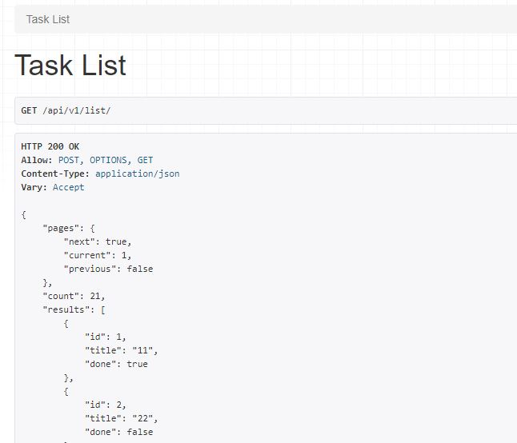
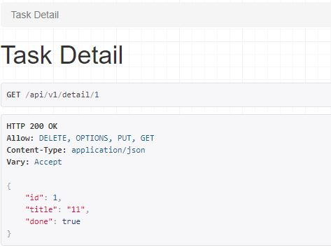

# Todo-API

This is a CRUD api for a todo list app

## Tech Stack

1. Django Rest Framework

## endpoints

1. http://127.0.0.1:8085/api/v1/list/
2. http://127.0.0.1:8085/api/v1/detail/1

## Screenshots

  

  

